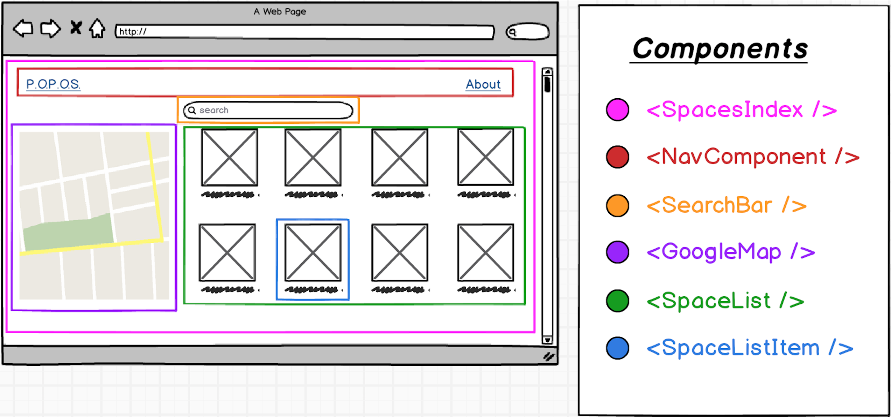

P.O.P.O.S.
===================
> Building a Single Page Application in React that shows all of San Francisco's Privately Owned Public Open Spaces.
> I will be using the data from [DataSF](https://data.sfgov.org/Culture-and-Recreation/Privately-Owned-Public-Open-Spaces/65ik-7wqd).
>
>

Mockup
-------------
>  
**landing page**
>

>
**all spaces**
>

>
**all spaces (*component breakdown*)**
>

>
**individual space**
>

>

----------

User Stories
-------------
>
- User should be able to use the search-field to search by address/cross street and receive the nearest *Spaces* to the specified location.
- User should be able to navigate to the *All Spaces* page, where all *Spaces* will be displayed.
- User should be able to click on a single *Space* (from the *All Spaces* page) and the user will be redirected to an individual *Space's* show page that contains specific details about this *Space*.

>

----------

Technologies Used
-------------
>
 - [Reactjs](https://reactjs.org/)
- [React Router](https://reacttraining.com/react-router/)
- [nodejs](https://nodejs.org/en/)
- [expressjs](https://expressjs.com/)
- [mongoDB](https://www.mongodb.com/)
- [Heroku](https://heroku.com/)
- [Google Maps API](https://developers.google.com/maps/documentation/javascript/)
- [axios](https://github.com/axios/axios)
- [react-google-maps](https://github.com/tomchentw/react-google-maps)

----------

React Router DOM v4
-------------
>
**BrowserRouter**
>
> One of the high-level routers for client side React apps, that makes use of *HTML5 history API* to sync your UI with the current browser's url path (*i.e. window.location*).
>
> If you are using a dynamic server that can handle dynamic URLs then you need to use the **BrowserRouter** component.
>  
>  A good article that covers *BrowserRouter*: [React Router DOM v4 Tutorial](https://www.techiediaries.com/react-router-dom-v4/) by *Techiediaries*.
>  
> [official documentation](https://github.com/ReactTraining/react-router/blob/master/packages/react-router-dom/docs/api/BrowserRouter.md)
>
----------
>
**Switch**
>
> Renders the first ```<Route``` or ```<Redirect>``` that matches the location.
>  
> ```<Switch>``` is unique in that it renders a route *exclusively*. In contrast, every ```<Route>``` that matches the location renders *inclusively*.
>
> [official documentation](https://github.com/ReactTraining/react-router/blob/master/packages/react-router/docs/api/Switch.md)
>
----------
>
**Route**
>
> The *Route* component is perhaps the most important component in *React Router* to understand and learn the use well.
>  
> Its most basic responsibility is to render some UI when a location matches the route's ```path```.
>
> [official documentation](https://github.com/ReactTraining/react-router/blob/master/packages/react-router/docs/api/Route.md)
>
----------
>
**Link**
> Provides declarative, accessible navigation around your application.
>  
>  **to:object**
>  The *to* property in the **Link** component can accept an object that can have the following properties:
>  - ```pathname```: A *string* representing the path to link to.
>   - ```search```: A *string* represenation of query parameters.
>    - ```hash```: A *hash* to put in the *URL*, e.g. ```#a-hash```.
>   - ```state```: *State* to persist to the ```location```.
>   ```
>   // example
>   <Link to={{
>     pathname: '/courses',
>     search: '?sort=name',
>     hash: '#the-hash',  
>     state: { fromDashboard: true }
>   }}/>
>   ```
> [official documentation](https://github.com/ReactTraining/react-router/blob/master/packages/react-router-dom/docs/api/Link.md)
>
> In order to access this state in your component, you can use the ```this.props.location.state``` or ```this.props.history.location.state```
>
> Here is a stackoverflow article about [passing props with Link in React-Router](https://stackoverflow.com/questions/47287855/passing-props-with-link-in-react-router)
>
----------

CSS
-------------
>  The Flexbox Layout Module, makes it easier to design flexible responsive layout structure without having to use floats or positioning.
>
> [A Complete Guide to Flexbox](https://css-tricks.com/snippets/css/a-guide-to-flexbox/) is a good article that goes over flexbox's main concepts.
>   
> Here is an article that contains several example use-cases, [CSS Flexbox Cheatsheet](https://www.sketchingwithcss.com/samplechapter/cheatsheet.html)
>

>
>**flex-direction**
>
>The *flex-direction* property specifies the direction of the flexible items. **Note:** If the element is not a flexible item, the flex-direction property has no effect.
>
>*Defult value:* row
>

>
>**box-sizing**
>
>The ```box-sizing``` property allows us to include the padding and border in an element's total width and height.
>
>If you set ```box-sizing: border-box;``` on an element padding and border are included in the width and height.
>  
>

Blocks
-------------
>  
**DataSF**
> The data from the [DataSF](https://data.sfgov.org) api doesn't have an available id, which makes dealing with the show page a little bit more complicated. The ``` name ``` property seems to be unique among all the data, but might contain duplicates so querying the data might not be reliable.
>
>See request response:
```
// https://data.sfgov.org/resource/3ub7-d4yy.json?name=100 1st St
[
    {
        "accessibil": "Indirect through lobby elevator?",
        "art": "Yes",
        "case_no": "1983.331",
        "descriptio": "The large Sun Terrace features extensive landscaping and seating. Several art sculptures are featured, along with an elevated view of the street below. There is a 'grand' staircase (snippet) up to the Sun Terrace. Ground level arcade in front of building",
        "food": "Y",
        "food_servi": "At ground level",
        "hours": "Ground level arcade space accessible at all times, Sun Terrace open during daylight hours.",
        "hours_type": "Open At All Times",
        "landscapin": "Trees and plants",
        "location": "Sun Terrace is on second floor above adjoining parking garage SE of main building. Ground level arcade is on Mission Street side.",
        "name": "100 1st St",
        "popos_addr": "100 1st St",
        "restrooms": "None observed",
        "seating": "Y",
        "seating_an": "Y",
        "seating_no": "30 seats at 10 tables plus numerous areas to sit along built-in benches and planters, grassy areas.",
        "source": "SPUR, DT Plan 2009, Motion",
        "the_geom": {
            "type": "Point",
            "coordinates": [
                -122.39797,
                37.7891
            ]
        },
        "type": "Sun Terrace, Indoor Park, Snippet",
        "year": "1985"
    }
]
```
>

**Google Maps**
>
> While building out the ```GoogleMap``` component, I received this error: ```'google' is not defined  no-undef```
>
> After looking online, I found that two different solutions seemed to resolve the issue:
> - One: when adding ```/* eslint-disable no-undef */ ``` to the top of my ```GoogleMap``` component file, the error went away and successfully displayed the map.
> - Two: When creating a new instance of the ```Map``` using ```new window.google.maps.Map()``` instead of ```new google.maps.Map()``` also resolved the error and displayed the map.
>
>
>  Here is a [github issue](https://github.com/tomchentw/react-google-maps/issues/414)  that went over this problem.
>
>
> Here is a [github issue](https://github.com/istarkov/google-map-react/issues/303) that addresses the error:
> ```You have included the Google Maps API multiple times on this page. This may cause unexpected errors.```
>  
>


----------

Heroku
-------------
>
>  
> Using [mars Heroku Buildpack for create-react-app](https://github.com/mars/create-react-app-buildpack) for a fast and easy deploy.
>

>
>Here is the following steps to deploy your react project created with *create-react-app*, from the *mars documentation*:
>```
>create-react-app $APP_NAME
>cd $APP_NAME
>git init
>heroku create $APP_NAME --buildpack https://github.com/mars/create-react-app-buildpack.git
>git add .
>git commit -m "Start with create-react-app"
>git push heroku master
>heroku open
>```
>

>
>**Issue with React Router on Heroku**
>
> After successfully deploying to heroku with the mars heroku buildpack, the root URL was rendering, but other routers specified with *React Router* were not working.
>  
>  Creating a ```static.json``` file in the same directory as the ```package.json``` with the following contents:
>
>```
>{
>  "root": "build/",
>  "clean_urls": false,
>  "routes": {
>    "/**": "index.html"
>  }
>}
>```
>
> Basically the ```static.json``` file modifies Heroku's default webpack, so that it can handle client-side routing.
>  
>  Here is a good stackoverflow that provides a solution and explanation to [react routing works in local machine but not heroku](https://stackoverflow.com/questions/41772411/react-routing-works-in-local-machine-but-not-heroku)
----------
>
>This is also addressed in the *mars documentation* in [continue development](https://github.com/mars/create-react-app-buildpack#user-content-continue-development) under the section **Routing clean URLs**.
>


Helpful Links
-------------
>  
> [DataSF](https://data.sfgov.org) (api)
>
>

----------
