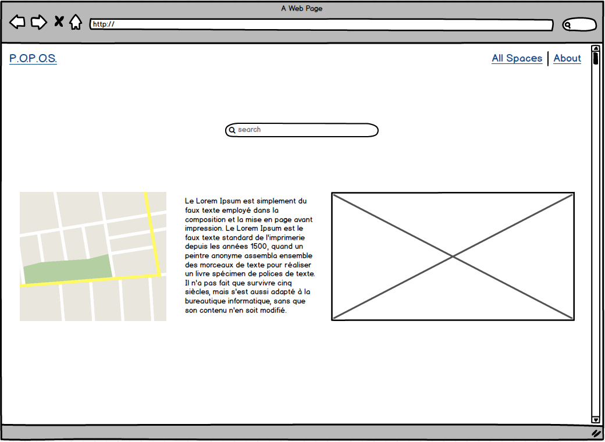

P.O.P.O.S.
===================
> Building a Single Page Application in React that shows all of San Francisco's Privately Owned Public Open Spaces.
> I will be using the data from [DataSF](https://data.sfgov.org/Culture-and-Recreation/Privately-Owned-Public-Open-Spaces/65ik-7wqd).
>
>

Mockup
-------------
>  
**landing page**
>

>

----------

Helpful Links
-------------
>  
>[DataSF](https://data.sfgov.org) (api)
>

----------
